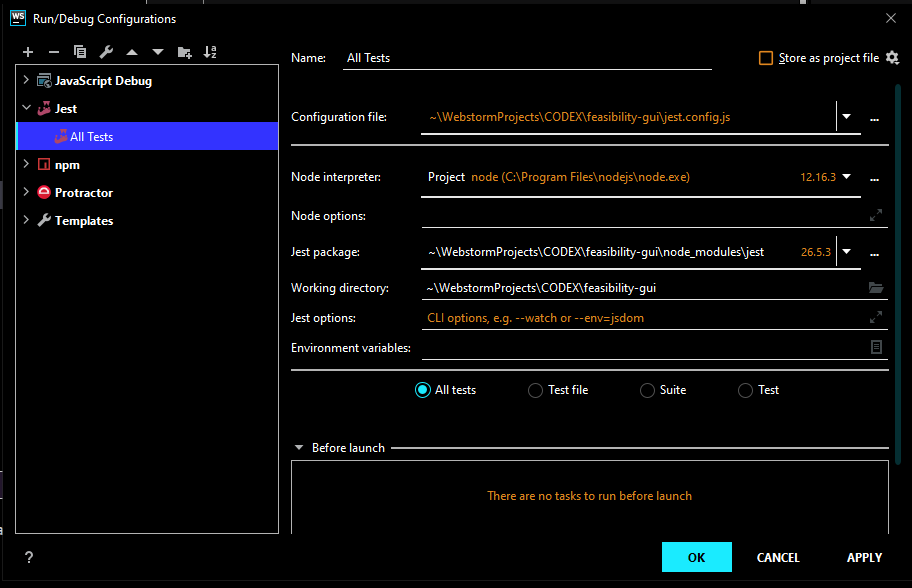
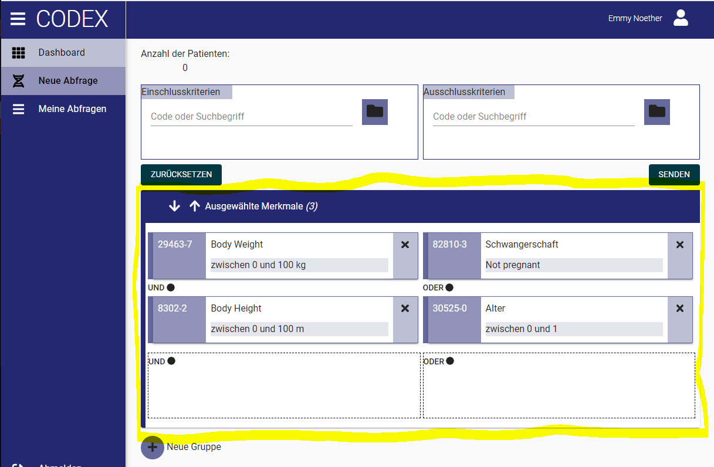
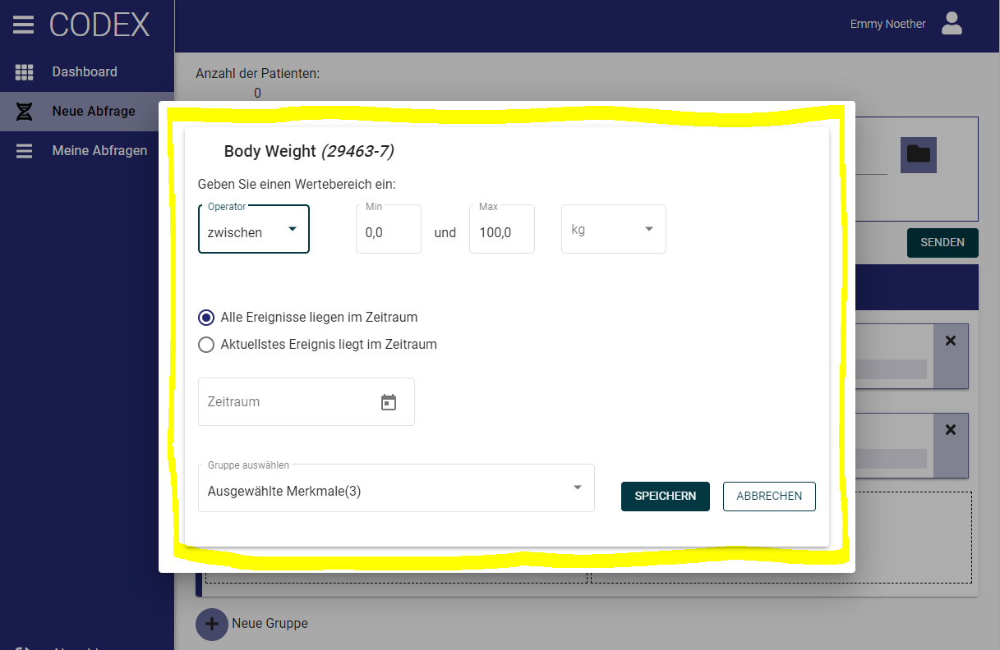
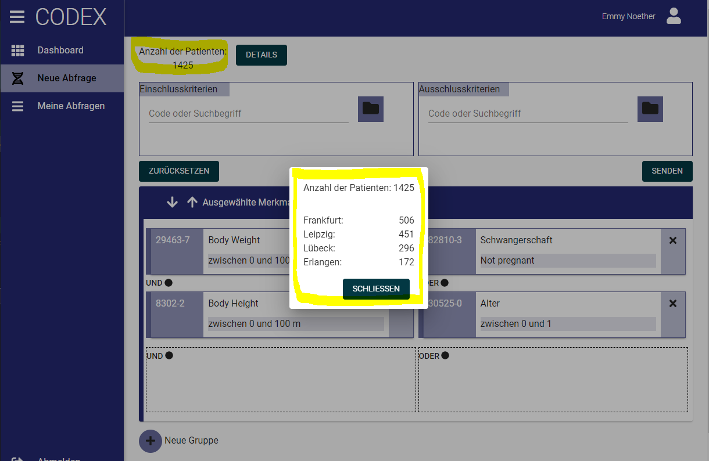
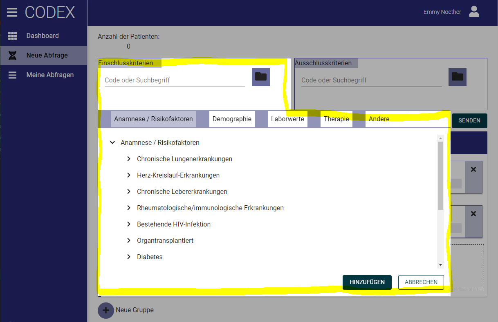

This document provides a quick How-To-Start guide to the CODEX UI.
* In the first part we give a general introduction to Angular and refer to examples in the code of the CODEX UI project.
* In the second part we describe some special classes of CODEX UI and its configuration.

# General Angular knowledge
## Getting started with Angular
<a href="https://angular.io/start" target="_blank">https://angular.io/start </a>
### Generate a component
```
ng g c modules/querybuilder/components/[name-of-component]
```
### Generate a service
```
ng g s modules/querybuilder/service/[name-of-service]
```

## Life cycle hooks
When data of a component changes Angular starts the change detection and life cycle hooks are called. The most important life cycle hooks are:
```
ngOnInt()       // called once when a component is created
ngOnChanges()   // called every time data input changes
ngOnDestroy()   // called once when a component is destroyed
```
See <a href="https://angular.io/guide/lifecycle-hooks" target="_blank">https://angular.io/guide/lifecycle-hooks </a>

## Dependency injection
#### Example: <a target="_blank" href="./src/app/modules/querybuilder/components/querybuilder-editor/display/display-criterion/display-criterion.component.ts" style="color: yellow">DisplayCriterionComponent</a>
Services can be injected into a component (or other service) by adding a public/private parameter to th constructor
```
constructor(public dialog: MatDialog, private featureService: FeatureService) {}
```

## Data handling (input and output)

### Regular components
#### Example: <a target="_blank" href="./src/app/modules/querybuilder/components/querybuilder-editor/display/display-criterion/display-criterion.component.ts" style="color: yellow">DisplayCriterionComponent</a>
##### Data input
The typescript class of a component needs to have the decorator @Input() in order to receive data from a parent component.
```
  @Input()
  query: Query
```
The parent component can then pass data into the component by using square brackets inside the HTML:
```
<num-display-query [query]="query" ...></num-display-query>
```
##### Data output
The typescript class of a component needs to have a decorator @Output() in order to emit events/data to a parent component.
```
  @Output()
  storeQuery = new EventEmitter<Query>()
```
The component can then pass an event (possibly with data) to the parent component by triggering the EventEmitter
```
  this.storeQuery.emit(query)
```

Inside the parent component the fired event can be catched using round brackets (inside the HTML). The special parameter $event contains the data emitted by
the event trigger and may be passed into a method of the parent component
```
<num-display-query ... (storeQuery)="storeQuery($event)"></num-display-query>
```

### Dialogs
In CODEX we use MatDialog to open PopUps (see <a href="https://material.angular.io/components/dialog/overview" target="_blank" >https://material.angular.io/components/dialog/overview </a>)
#### Example (dialog): <a target="_blank" href="./src/app/modules/querybuilder/components/querybuilder-editor/edit/edit-single-criterion/edit-single-criterion.component.ts" style="color: yellow">EditSingleCriterionComponent</a>
#### Example (opening comonent): <a target="_blank" href="./src/app/modules/querybuilder/components/querybuilder-editor/display/display-criterion/display-criterion.component.ts" style="color: yellow">DisplayCriterionComponent</a>
##### Data input
For inserting data into the dialog component we first define a data class (e.g. EditSingleCriterionComponentData).
When opening the dialog we pass the data inside the property *data* of the MatDialogConfig
```
    dialogConfig.data = {
      criterion: this.criterion,
      query: this.query,
      position: this.position,
    }
```
and then open the dialog on the injected MatDialog reference *dialog*
```    
    const dialogRef = this.dialog.open(EditSingleCriterionComponent, dialogConfig)
```
To handle the data inside the dialog component we must inject the value for the token *MAT_DATA_DATA*
```
  constructor(
    @Inject(MAT_DIALOG_DATA) public data: EditSingleCriterionComponentData,
    ...
  ) {
    this.criterion = data.criterion
    ...
  }
```
and can use the property *data* inside the constructor (or elsewhere in the class).

##### Data output
When opening the dialog we save a reference *dialogRef* to the MatDialog
```    
    const dialogRef = this.dialog.open(EditSingleCriterionComponent, dialogConfig)
```
This reference offers an observable emitting a value when the dialog is closed and we can subscribe to this observable
```
    this.subscriptionDialog?.unsubscribe()
    this.subscriptionDialog = dialogRef     // It is best practice to unsubscribe to possible former subscribtion
      .afterClosed()
      .subscribe((query) => this.storeQuery.emit(query))
```
To close the dialog we need a reference *dialogRef* to the dialog which can be injected (Dependency Injection) by
```
  constructor(
    ...
    public dialogRef: MatDialogRef<EditSingleCriterionComponent, Query>
  ) {
    ...
  }
```
When closing the dialog we can pass a value
```
  doSave(): void {
    this.dialogRef.close(this.queryModified)
  }
```
which is then emitted by the observable *dialogRef.afterClosed()* inside the opening component.

## RxJS (Observables)
Asynchronous programming can be achieved in several ways
* async/await
* Promises
* Observables
As for example the HttpClient or closing a MatDialog produce observables we mainly stick to observables in the CODEX project (Promises are used in some of the Vitagroup framework code)

Observables can be thought of as newspaper subscriptions. You can subscribe to an observable and receive its values over the time until you unsubscribe to it.

Remark 1: Always unsubscribe to observables (e.g. in the ngOnDestroy() life cycle hook or before subscribing to a subsequent observable)
Remark 2: An observable is cold when it has no subscriptions. In this case no value is deliverd. For example when noone subscribes to a HTTP-call it will not be send to the server.

Observables are very powerful as they can be combined by operators (usually using pipe() ). 
You can visualize operators by marble diagrams <a target="_blank" href="https://rxmarbles.com/">https://rxmarbles.com/ </a>
Marbles can also be used for testing (see <a href="https://medium.com/@bencabanes/marble-testing-observable-introduction-1f5ad39231c" target="_blank">Marble testing Observable Introduction </a>)
#### Example (marble testing): <a target="_blank" href="./src/app/modules/querybuilder/components/querybuilder-editor/search/search-input/search-input.component.spec.ts" style="color: yellow">src/app/modules/querybuilder/components/querybuilder-editor/search/search-input/search-input.component.spec.ts</a>

## REST (HttpClient)
#### Example: <a target="_blank" href="./src/app/modules/querybuilder/service/backend.service.ts" style="color: yellow">BackendService</a>

In order to write an HTTP client we need to inject a HttpClient
```
  constructor(
    private http: HttpClient
  ) {}
```
We can then simply apply methods like get(), post(), ...
```
  this.http.get<Array<CategoryEntry>>(this.createUrl(...))
```

see <a href="https://angular.io/guide/http" target="_blank">https://angular.io/guide/http </a>

## Testing
<span style="color:cyan; font-weight: bold">Current test coverage is 99% (actually 100% of all components, services and other classes representing logic - only some model classes are insufficiently covered by tests)</span>

When a component or service is created via the Angular CLI we obtain a first basic test which already configures a TestBed. 

It is important and worth the effort to learn writing tests. This helps to keep the CODEX UI maintinable.
Some sources for learing are:
* <a href="https://codecraft.tv/courses/angular/unit-testing/classes-and-pipes/" target="_blank">https://codecraft.tv/courses/angular/unit-testing/classes-and-pipes/ </a>
* <a href="https://angular.de/artikel/angular-testing/" target="_blank">https://angular.de/artikel/angular-testing/ </a>
* <a href="https://angular.io/guide/testing" target="_blank">https://angular.io/guide/testing </a>
* <a href="https://medium.com/@bencabanes/marble-testing-observable-introduction-1f5ad39231c" target="_blank">Marble testing (Observables) </a>

### <span style="color: red">ALWAYS run tests before committing to a GIT repo. </span>
### <span style="color: red">Run tests 'with coverage' to detect untested code </span>



## Angular Material
We use <a href="https://material.angular.io/components/categories" target="_blank">Angular Material </a> as a component framework.
Most Angular material components are provided with examples which can easily adopted.

## Internationalization (i18n)
The translation is mainly provided by the config files:
* src/assets/i18n/de.json
* src/assets/i18n/en.json

The keys are then translated by using the pipe *translate* in the HTML file
```
  {{ 'QUERYBUILDER.EDIT.GROUPS.AFTER' | translate }}
```
or with parameters
```
  {{ 'QUERYBUILDER.HINT.MINIMUM_EXCEEDED' | translate: { min: filter.min } }}
```
# CODEX UI
The CODEX UI is built on top of a sceleton designed by Vitagroup (handling the menu config and the Keycloak).
Besides this thin sceleton the main code of the CODEX is located at
```
	src/app/modules/querybuilder
```

## Configuration
The main configuraton is declared in *IAppConfig* and specified in the file
```
	src/assets/config/config.dev.json
```

| Name | Description                                                                                      | Value                        |
|---|--------------------------------------------------------------------------------------------------|------------------------------|
| env | Name of config profile                                                                           | dev                          |
| uiBackendApi.baseUrl | URL of Backend                                                                                   | http://localhost:8090/api/v1 |
| auth.baseUrl | URL of Keycloak                                                                                  | http://localhost:8080        |
| auth.realm | Realm of Keycloak                                                                                | codex-develop                |
| auth.clientId | Client ID for Keycloak                                                                           | feasibility-gui              |
| features.v2.multiplevaluedefinitions | Allow more than one value restriction per concept (unused for structured queries with version 1) | true                         |
| features.v2.multiplegroups | Allow more than one group of criteria (unused for structured queries with version 1)             | true                         |
| features.v2.dependentgroups | Allow linking groups (unused for structured queries with version 1)                              | true                         |
| features.v2.timerestriction | Allow defining time restrictions for a concept (unused for structured queries with version 1)    | true                         |
| features.extra.displayvaluefiltericon | Show icons instead of UTF8 characters for comparators                                            | false                        |
| features.extra.showoptionspage | Show additional page for live changing the config variables                                      | false                        |
| features.extra.sendsqcontexttobackend  | add context information to each criteria in Structured Query                                     | true                         |
| features.options.pollingtimeinseconds | Period of time (in seconds) for polling the ui backend                                           | 10                           |
| features.options.pollingintervallinseconds | Intervall (in seconds) for polling the ui backend                                                | 1                            |
| features.options.lowerboundarypatientresult | Patient results will be obfuscated if they are lower than this boundary                          | 10                           |
| features.stylesheet | Defines the branding of the UI                                                                   | codexTheme / abideTheme      |
| features.fhirport |                                                                                                  | 8082                         |
| features.queryVersion | Defines the version of the Structured Query (v1: used in Codex, v2: used in Abide)               | v1 / v2                      |


For development purposes we supply additional config properties

| Name | Description | Value |
|---|---|---|
| mock.terminology | allow mocking a terminology (not using a backend) | false |
| mock.query | mock sending queries (not using a backend) | false |
| mock.result | simulate a result (not using a backend) | false |

## Model
### Query
The internal model of the CODEX UI basically reflects the structured query defined by CODEX (see <a href="https://github.com/num-codex/codex-structured-query" target="_blank">https://github.com/num-codex/codex-structured-query </a>)

However, as the structured query (Version 1) does not support following features:
* timerestrictions              // TimeRestriction
* multiple groups               // Query.groups (as array)
* dependencies between groups   // Group.dependencyInfo
* multiple value restrictions   // Criterion.valueFilters (as array)

we have enriched the model by these features.

Before sending a query to the backend we must therefore translate it to an object of type QueryOnlyV1.
This translation is done by the controller class ApiTranslator.

A query (internal model) has several levels

| Level 1  | Level 2   | Level 3                                               | Level 4             | Level 5         |
|----------|-----------|-------------------------------------------------------|---------------------|-----------------|
| **Query** | groups    |                                                       |                     |                 |
|          | **Group** | inclusionCriteria / exclusionCriteria                 |                     |                 |
|          |           | **Criterion[][]** <br/><br/>(refered to as CritGroup) | Criterion[ i ][ j ] |                 |
|          |           |                                                       | **Criterion**       | valueFilters    |
|          |           |                                                       |                     | **ValueFilter** |

These levels are also reflected by hierarchies of components

* DisplayQueryComponent
* DisplayGroupComponent
* DisplayCritGroupComponent
* DisplayCriterionComponent
* DisplayValueComponent

### TerminologyEntry
A terminology entry represents an entry from an ontology delivered by the backend. Its basic parts are

| Property | Description |
|---|---|
| *termCode*  | key of the terminology entry |
| *selectable*  | flag, if entry is selectable |
| *leaf/children*  |flag, if entry has children and possibly its children - if already deliverd by the backend |
| *timeRestrictionAllowed*  | flag, if time can be restricted for this concept |
| *valueDefinitions*  | defines if concept can be restricted by values of type QUANTITY or CONCEPT - also ranges, precision, units, min/max (QUANTITY) or allowed values (CONCEPT) are defined by the backend |

## Components
* src/app/modules/querybuilder/components/querybuilder-editor/display
  
Contains components for diplaying a query or its parts (without modifying it)



* src/app/modules/querybuilder/components/querybuilder-editor/edit

Contains components for modifying a query (or its parts)



* src/app/modules/querybuilder/components/querybuilder-editor/result

Contains components for showing a result



* src/app/modules/querybuilder/components/querybuilder-editor/search

Contains components for searching



## Services
| Service | Description |
|---|---|
| **BackendService** | Provides REST calls to backend |
| **MockBackendDataProvider** | Provides a mocked terminology (when developing UI without backend) |
| **QueryProviderService** | Stores and retrieves a query from local storage |
  
## Controller
| Controller | Description |
|---|---|
| **ApiTranslator** | Translates a query to a structured query defined of version 1  |
| **CritGroupArranger** | Helps rearranging groups and critGroups (e.g. used for Drag&Drop of criteria) |
| **GroupFactory** | Creates a new group with a unique id |
| **ObjectHelper** | Helpes comparing objects (by using string representations) |
| **TermEntry2CriterionTranslator** | Creates an ampty Criterion defined by a terminology entry (ontology deliverd by backend) |

## Keycloak and Backend
To use the CODEX UI (even for development) we must have a Keycloak running. The easiest way is to checkout <a href="https://github.com/num-codex/codex-keycloak" target="_blank">https://github.com/num-codex/codex-keycloak </a>, maven install and use Docker:
```
  docker run -p 8080:8080 -d codexkeycloak
```

Developing without a backend is possible (using the mock properties of the IAppConfig).
However, it is also quite easy to run a backend using Docker-Compose
See <a href="https://github.com/num-codex/codex-feasibility-backend" target="_blank">https://github.com/num-codex/codex-feasibility-backend </a>
